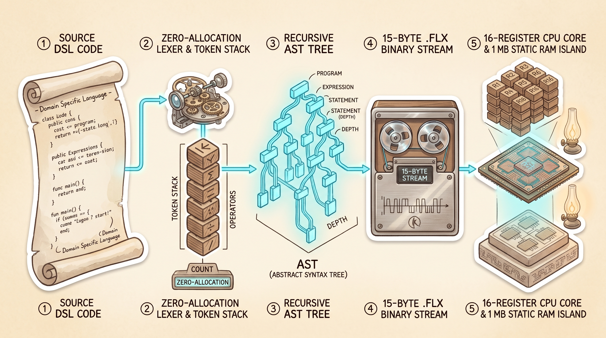

<div align="center">


# ⚡ flux-lang

### *Deterministic Bytecode Toolchain & Virtual Execution Island*

[](#-tech-stack--toolchain-pipeline)
[](#-architecture--isa-reference)
[](#3-custom-heap-manager-1-mb-static-ram)
[](#-tech-stack--toolchain-pipeline)
[](./LICENSE)
[](#-roadmap--milestones)

</div>

<br>

| <br> **Kuro 🦫**<br>*The Compiler Beaver* | **flux-lang** is a zero-dependency, deterministic systems compiler and register virtual machine constructed entirely from first principles in pure Go.<br><br>Designed to bypass runtime garbage collector pauses ($\Delta t_{\text{GC}} = 0$), **flux-lang** translates human-readable systems assembly into a compact `.flx` binary wire format and executes it within a self-managed **1 MB static RAM island** equipped with 16 general-purpose registers, condition flags, an execution call stack, and first-fit heap management. |
| :---: | :--- |

---

## 📜 The Lore & Motivation

For many systems engineers, building an entire language toolchain from raw characters to silicon-level emulation is a defining milestone. In modern software engineering, layers of high-level abstractions, JIT compilers, runtime garbage collectors, and third-party frameworks often obscure the mechanical reality of how software actually interacts with memory and instruction decoders.

**`flux-lang` was born out of a long-held engineering aspiration to deeply demystify every phase of the translation pipeline without relying on external libraries or parser generators:**

1. **Zero-Allocation Lexical Scanning:** How sequential byte cursors produce strongly-typed tokens as sub-slices of a source buffer without a single heap allocation.
2. **Recursive Descent AST Synthesis:** How grammars are transformed into deterministic abstract syntax trees while preserving error recovery and diagnostic accumulation.
3. **Two-Pass Binary Code Generation:** How forward-jumping labels, subroutine offsets, and string constant pools are resolved and backpatched into binary bytecode.
4. **Virtual CPU Dispatch & Call Stack:** How an instruction pointer (`PC`) loops through a flat code section, manages CPU condition flags (`ZeroFlag`, `SignFlag`), and executes nested/recursive subroutines via call stack push/pop operations.
5. **Deterministic Static RAM Island:** How a manual First-Fit heap allocator manages dynamic memory blocks within a fixed 1 MB array with block splitting, header tracking, and double-free traps.

At its fundamental core, computing is **instruction dispatch and memory bounds**. `flux-lang` is the realization of constructing an entire execution ecosystem from first principles.

```text
+-----------------------------------------------------------------------------------------+
|                                 THE FLUX PIPELINE FLOW                                  |
+-----------------------------------------------------------------------------------------+
|  [ Source Text (.flx) ]                                                                 |
|         │                                                                               |
|         ▼  (Zero-Alloc Substring Slicing)                                               |
|  [ Lexer (Token Stream) ]                                                               |
|         │                                                                               |
|         ▼  (Recursive Descent & Diagnostic Accumulation)                                |
|  [ AST (ast.Program) ]                                                                  |
|         │                                                                               |
|         ▼  (Two-Pass Assembler & Label Backpatcher)                                     |
|  [ Flat .flx Wire Binary ] ── [ 15-Byte Magic Header + String Pool + Code Section ]     |
|         │                                                                               |
|         ▼  (Byte-for-Byte Virtual CPU Loader)                                           |
|  [ Register CPU (R1..R16) ] <════> [ 1 MB Static RAM Island (Alloc/Free/Split) ]        |
|         │                                                                               |
|         ▼  (CallStack & Flags: ZeroFlag, SignFlag, PC, SP)                              |
|  [ Deterministic Execution: Loops, Subroutines, Events & Hardware Pins ]                |
+-----------------------------------------------------------------------------------------+
```

### The 4 Core Architectural Pillars

* **⚡ Zero Host Allocation During Execution:** Once loaded, the VM operates exclusively inside a 1 MB static byte array (`var RAM [1024*1024]byte`). Host OS memory management is never triggered, eliminating runtime GC jitter ($\Delta t_{\text{GC}} = 0$).
* **🧩 Clean Pipeline Decoupling:** The compiler (`flux/compiler`) and the runtime engine (`flux/vm`) are separate, independent Go modules communicating exclusively through the `.flx` binary wire specification.
* **🛡️ Hardened Memory Invariants:** Manual memory management enforces strict safety checks: out-of-bounds pointers yield `memory: invalid address`, and duplicate frees immediately halt execution with `memory: double free`.
* **🔌 Hardware & Multi-Valued Extensibility:** Built-in GPIO pin triggers (`OP_TRIGGER_PIN`) and event hooks (`OP_ON_CHAT`) provide a foundation for real-time telemetry and balanced-ternary integration.

> [!NOTE]
> *"Building a virtual machine from first principles teaches you that memory is not an infinite cloud, but a physical territory of indices, headers, and alignment bounds. When you manage every single byte yourself, software becomes completely deterministic."*

---

## 🛠 Tech Stack & Toolchain Pipeline

<div align="center">
  
  <br>
  <sub><b>Figure 1:</b> Full-stack pipeline from zero-allocation source parsing to register execution and static memory management.</sub>
</div>

<br>

`flux-lang` is constructed with **zero third-party dependencies**, utilizing only the Go standard library (`strings`, `bytes`, `encoding/binary`, `bufio`, `os`, `fmt`, `errors`).

| Layer / Component | Location | Technical Implementation | Status |
| :--- | :--- | :--- | :---: |
| **Lexer** | `compiler/lexer` | Sequential single-pass cursor scanner; zero allocations; sub-slice token literals |  |
| **AST** | `compiler/ast` | Node interfaces (`Statement`, `Expression`) with tree dumping & diagnostic formatting |  |
| **Parser** | `compiler/parser` | Recursive-descent parser with diagnostic accumulation and block heuristic delimiters |  |
| **Codegen** | `compiler/codegen` | Two-pass binary assembler with string constant deduplication and label backpatching |  |
| **Virtual CPU** | `vm/cpu` | 16 general-purpose 32-bit registers, condition flags (`ZF`, `SF`), call stack, dispatch loop |  |
| **Heap Manager** | `vm/memory` | 1 MB static RAM island with first-fit traversal, 6-byte headers, block splitting & free coalesce |  |
| **CLI Toolchain** | `compiler/main.go`<br>`vm/main.go` | CLI utilities (`flux-compiler` and `flux-vm`) supporting standard UNIX pipelines and REPL |  |

---

## 📐 Architecture & ISA Reference

### 1. The `.flx` Binary Wire Format

The compiled `.flx` executable consists of a fixed 15-byte header followed by the deduplicated string constant pool and the flat bytecode stream:

```text
+-----------------------+---------------+-----------------------+-----------------------+-----------------------+
|  Magic "FLUX" (4 B)   | Version (1 B) | ConstantCount (2 B BE)| CodeSectionOff (4 B)  | CodeSectionSize (4 B) |
+-----------------------+---------------+-----------------------+-----------------------+-----------------------+
|  Constant Pool: [ Length: Uint16 BE ][ UTF-8 String Data N Bytes ] ...                                       |
+---------------------------------------------------------------------------------------------------------------+
|  Code Section: [ Raw Instruction Bytecode Stream ... ]                                                        |
+---------------------------------------------------------------------------------------------------------------+
```

### 2. Complete Instruction Set Architecture (ISA)

The virtual CPU decodes single-byte opcodes with big-endian immediate operands:

| Opcode | Mnemonic | Layout | Semantics & Behavior |
| :---: | :--- | :--- | :--- |
| `0x01` | `OP_ALLOC` | `[0x01] [Reg:1] [Size:4 BE]` | `Registers[Reg] = Heap.Alloc(Size)` |
| `0x02` | `OP_FREE` | `[0x02] [Reg:1]` | `Heap.Free(Registers[Reg])` |
| `0x03` | `OP_MOV_REG_REG` | `[0x03] [Dst:1] [Src:1]` | `Registers[Dst] = Registers[Src]` |
| `0x04` | `OP_MOV_REG_INT` | `[0x04] [Dst:1] [Val:4 BE]` | `Registers[Dst] = Val` |
| `0x05` | `OP_MOV_REG_STR` | `[0x05] [Dst:1] [ConstIdx:4 BE]` | Copies string from pool to Heap; sets `Registers[Dst] = Ptr` |
| `0x06` | `OP_TRIGGER_PIN` | `[0x06] [Pin:1] [State:1]` | Toggles hardware GPIO pin simulation |
| `0x07` | `OP_SEND_CHAT` | `[0x07] [Operand:4 BE]` | High bit 31 set: Constant Index; Bit 31 clear: Register Ptr |
| `0x08` | `OP_ON_CHAT` | `[0x08] [TrigIdx:4] [Reg:1] [Start:4] [Len:4]` | Registers event handler; skips body in linear execution |
| `0x09` | `OP_ADD` | `[0x09] [Dst:1] [Src:1]` | `Registers[Dst] = Registers[Dst] + Registers[Src]` (wrapping uint32) |
| `0x0A` | `OP_SUB` | `[0x0A] [Dst:1] [Src:1]` | `Registers[Dst] = Registers[Dst] - Registers[Src]` (wrapping uint32) |
| `0x0B` | `OP_MUL` | `[0x0B] [Dst:1] [Src:1]` | `Registers[Dst] = Registers[Dst] * Registers[Src]` (wrapping uint32) |
| `0x0C` | `OP_DIV` | `[0x0C] [Dst:1] [Src:1]` | `Registers[Dst] = Registers[Dst] / Registers[Src]` (traps on divide-by-zero) |
| `0x0D` | `OP_AND` | `[0x0D] [Dst:1] [Src:1]` | `Registers[Dst] = Registers[Dst] & Registers[Src]` (bitwise AND) |
| `0x0E` | `OP_OR` | `[0x0E] [Dst:1] [Src:1]` | `Registers[Dst] = Registers[Dst] \| Registers[Src]` (bitwise OR) |
| `0x0F` | `OP_XOR` | `[0x0F] [Dst:1] [Src:1]` | `Registers[Dst] = Registers[Dst] ^ Registers[Src]` (bitwise XOR) |
| `0x10` | `OP_SHL` | `[0x10] [Dst:1] [Src:1]` | `Registers[Dst] = Registers[Dst] << Registers[Src]` (0 if shift $\ge 32$) |
| `0x11` | `OP_SHR` | `[0x11] [Dst:1] [Src:1]` | `Registers[Dst] = Registers[Dst] >> Registers[Src]` (0 if shift $\ge 32$) |
| `0x12` | `OP_CMP` | `[0x12] [Reg1:1] [Reg2:1]` | Updates condition flags: `ZeroFlag = (Reg1 == Reg2)`, `SignFlag = (Reg1 < Reg2)` |
| `0x13` | `OP_JMP` | `[0x13] [TargetPC:4 BE]` | Unconditional branch: `PC = TargetPC` |
| `0x14` | `OP_JZ` | `[0x14] [TargetPC:4 BE]` | Branch if `ZeroFlag == true`: `PC = TargetPC` (else `PC += 5`) |
| `0x15` | `OP_JNZ` | `[0x15] [TargetPC:4 BE]` | Branch if `ZeroFlag == false`: `PC = TargetPC` (else `PC += 5`) |
| `0x16` | `OP_CALL` | `[0x16] [TargetPC:4 BE]` | Pushes return address (`PC + 5`) to `CallStack`, jumps to `TargetPC` |
| `0x17` | `OP_RET` | `[0x17]` | Pops return address from `CallStack` to `PC` (traps on stack underflow) |

---

### 3. Custom Heap Manager (1 MB Static RAM)

The virtual heap operates entirely within a contiguous 1 MB array without calling host allocation primitives:

```text
+-----------------------+------------------+------------------+------------------------------------+
|  BlockSize (4 Bytes)  | IsAlloc (1 Byte) | Padding (1 Byte) |         Data Payload (N Bytes)     |
|   uint32 Big-Endian   | 0 = Free, 1 = Occ|  Alignment Pad   |        User Allocated Cells        |
+-----------------------+------------------+------------------+------------------------------------+
```

* **Allocation Policy:** First-Fit traversal from heap base address `0x000000`.
* **Block Splitting:** Occurs automatically if the remainder of an unallocated block satisfies $\text{remainder} \ge 6\text{ bytes}$ (Header Size).
* **Fault Detection:** 
  * Unaligned address or address outside RAM boundaries returns `memory: invalid address`.
  * Attempting to free an already unallocated block returns `memory: double free`.
  * Heap exhaustion returns `ErrOOM` (`memory: out of memory`).

---

## 🚀 Quick Start & Practical Execution

### 1. Compile a Program to Bytecode

You can pipe flux source code directly into the compiler CLI or compile a file to emit a `.flx` binary:

```bash
cd flux-lang/compiler

# Compile a program utilizing subroutines, arithmetic, loops, and event hooks
echo '
ALLOC R1, 32
MOV R1, "System Booted"
SEND_CHAT R1
FREE R1

; Calculate 5! (factorial) using a subroutine
MOV R1, 5
CALL factorial
JMP after_math

factorial:
  MOV R2, 1
  MOV R3, 1
fact_loop:
  CMP R1, R3
  JZ fact_done
  MUL R2, R1
  SUB R1, R3
  JMP fact_loop
fact_done:
  MOV R1, R2
  RET

after_math:
; Register real-time event hook
ON_CHAT "!hype", R4
  SEND_CHAT "Hype triggered!"
  TRIGGER_PIN 18, 1
' | go run main.go -o ../vm/program.flx -
```

### 2. Execute within the Virtual Machine

```bash
cd ../vm

# Run the compiled bytecode inside the virtual execution island
go run main.go program.flx
```

### 3. Interactive Chat Event Simulation

While running `flux-vm`, trigger registered event handlers by feeding standard chat messages:

```text
[flux-vm] Loaded program.flx (Code size: 84 bytes, Constants: 3)
[flux-vm] Executing bootstrap sequence...
>>> System Booted
[flux-vm] Factorial result in R1: 120
[flux-vm] Listening for events. Type '<user>: <message>' or 'exit':

Alice: !hype
>>> Hype triggered!
[flux-vm] GPIO Pin 18 set to HIGH (1)
```

### 4. Run the Full Test Suite

Execute all unit and integration test suites across both modules:

```bash
# Test compiler (Lexer, Parser, AST, Codegen, CLI)
cd flux-lang/compiler && go test ./... -v -count=1

# Test virtual machine (Heap Manager, CPU, ALU, Branching, CallStack)
cd ../vm && go test ./... -v -count=1
```

---

## 🗺 Roadmap & Milestones

```text
┌──────────────────────────────────────────────────────────────────────────────────┐
│                             FLUX ROADMAP TIMELINE                                │
├─────────────────────────┬─────────────────────────┬──────────────────────────────┤
│ Phase 1: Turing Core    │ Phase 2: Ternary Logic  │ Phase 3: Hardware & Sockets  │
│ [====================]  │ [····················]  │ [····················]       │
│ Complete (100%)         │ Q3 / Q4                 │ Upcoming                     │
└─────────────────────────┴─────────────────────────┴──────────────────────────────┘
```

- [x] **Phase 1: Core Language & ALU (Turing-Complete Embedded Scripting)**
  - [x] 16 general-purpose 32-bit registers (`R1`–`R16`).
  - [x] 1 MB static RAM First-Fit heap manager (`ALLOC`, `FREE`, block splitting, double-free safety).
  - [x] Full 9-instruction 3-byte ALU (`ADD`, `SUB`, `MUL`, `DIV`, `AND`, `OR`, `XOR`, `SHL`, `SHR`).
  - [x] Condition flags (`ZeroFlag`, `SignFlag`) and comparison operator (`CMP`).
  - [x] Unconditional and conditional branching (`JMP`, `JZ`, `JNZ`) with label backpatching.
  - [x] Subroutine call stack execution (`CALL`, `RET`, `MaxCallStackDepth` recursion guards).
- [ ] **Phase 2: Ternary Logic & Multi-Valued Architecture**
  - [ ] Native Trit (`-1`, `0`, `+1`) and 9-trit Tryte data types.
  - [ ] Kleene 3-valued logic gates (`AND3`, `OR3`, `NOT3`).
  - [ ] Balanced-ternary arithmetic unit.
- [ ] **Phase 3: Hardware Emulation & Socket Integration**
  - [ ] Live Twitch IRC TCP socket daemon.
  - [ ] Real-time I2C / SPI peripheral bus mock.
  - [ ] Interrupt vector table (`IVT`) for hardware pin interrupts.
- [ ] **Phase 4: Runtime Hardening & Tooling**
  - [ ] Standalone Disassembler (`flux-disasm`).
  - [ ] Bytecode optimization passes (constant folding, dead code elimination).
  - [ ] Interactive step debugger & visual TUI memory inspector.

---

## 📄 License

This project is licensed under the terms of the **ISC License**. See the [LICENSE](./LICENSE) file for complete details.

<br>

<div align="center">
  <sub>Engineered with obsession for deterministic systems. Built by <a href="https://github.com/Ri4ards2006">Richard Zuikov</a>.</sub>
</div>
